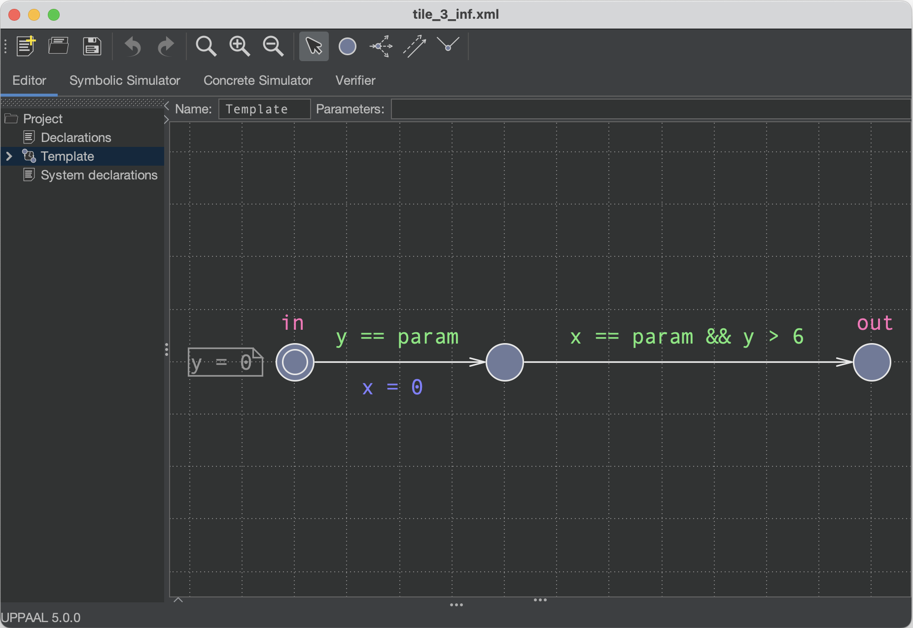

# utotparser

---

This tool aims at providing a way of checking the emptiness of Timed Automata (TA) (one can restrict the checking only to non-reset-test TAs, see below), as well as serving as a conversion tool from UPPAAL to tChecker syntax.
Due to the limited scope of our usage, the tool can convert only a limited set of the possible TAs one can create in UPPAAL.

---

## Table of Contents

- [How to install](#how-to-install)
- [Using the converter](#using-the-converter)
- [Using the checker](#using-the-checker)
- [Using the grapher](#using-the-grapher)
- [Using the constructor](#using-the-constructor)
- [Summary on outputs](#summary-on-outputs)
- [Minor things](#minor-things)

<a name="how-to-install"></a>

## How to install

Once cloned, in order to get the executables, navigate inside the corresponding folder and perform the following commands:
```
mkdir build
cd build
cmake -DTCHECKER_BIN_PATH="/path/to/tChecker/bin" ..
make
```
Please be careful when performing the above commands, since the path to the tChecker executable will be retrieved by the path given during the build process (however, it is still possible to specify it afterwards, see "Using the checker" section for more details). <br>
Here, `"/path/to/tChecker/bin"` is the path to the bin folder of your actual tChecker installation (the folder containing the four tools provided by tChecker, so to speak).<br>
Once the steps above have been completed, exit from the build directory by using the `cd ..` command. You will find the executables in the `executables` directory.

---

<a name="using-the-converter"></a>

## Using the converter

In order to start the converter tool, one can decide to simply launch the executable:
```
./converter
```
Notice that in this way, the source `.xml` files must be inserted in the `inputFiles` folder, while relatives outputs will be found in the `outputFiles` folder (the ones located in the utotparser directory).

Additionally, one can also specify the paths where source files are located, as well as the output destination, by passing them as command-line arguments:
```
./converter -src /path/to/source/directory -dst /path/to/destination/directory
```

Finally, different options can further be specified: <br>
The option `-jsn` can be included to output the json files obtained during the conversion:
```
./converter -jsn
```
The option `-nrt` can be included to translate only nrtTAs:
```
./converter -nrt
```

The above options can be specified in any order, e.g. one could write for example:
```
./converter -nrt -src /path/to/source/directory -jsn
```
**IMPORTANT:** altough options can be specified in any order, always keep in mind that paths for specifying input and output directories must be specified right after their respective option. Thus, something like `./converter -src /path/to/source/directory` is correct, while  `./converter -src -nrt /path/to/source/directory` will not work.

When launched, all `.xml` files in the chosen source directory will be converted in `.tck` files in the chosen output directory.

Please stick to these executions options, no side-checks are done if different command-line arguments are given.<br>
Please note that the converter will work only with `.xml` files.

## Additional nrtTA design conventions

Furthermore, when designing TAs in UPPAAL, the following conventions have to be respected:
* Do not add any comment to locations or transitions.
* UPPAAL files must be saved with the `.xml` extension.
* In UPPAAL final states must have a color (all states with a color will be marked as final).
* Clock declarations must be written like this: `clock x, y, z;`.
* Invariants must be written like this: `x < 2 && y == 1`.
* Guards must be written like this: `x < 2 && y > 1`.

Please remember to keep blank spaces between clocks and other symbols if you then want to perform nrt condition detection.

---

<a name="using-the-checker"></a>

## Using the checker

In order to see if a TA's language is empty or not, you can call the checker tool by using the following command:
```
./checker
```
It is possible also in this case to specify the directory from which to take the TAs to check. This can be done by adding the following option:
```
./checker -dst /path/to/tck_files/directory
```
In this case we still use the `-dst` option since, normally, files by the checker will be taken from the destination directory of the converter.<br>
Please note that the checker will work only with `.tck` files.

In addition, one can also manually specify the path to tChecker's bin directory while calling the checker by means of the following option:
```
./checker -lns /path/to/tChecker/bin
```

When using the checker, the `-all` option is available in order to decide whether to log all the parameter values tested during the TAs analysis or to stop at the first acceptance condition found.
```
./checker -all
```
The above command will force the checker to log all the values tested. Not putting the `-all` option will result in the tool stopping at the first acceptance condition met.

---

<a name="using-the-grapher"></a>

## Using the grapher

This tool offers graphical capabilities for showing the TAs under analysis.<br>
In order to produce a pdf view of the TAs, the grapher tool can be called with the following command:
```
./grapher
```
With this command, all the `.dot` files contained in the `outputDOTs` directory will be translated into `.pdf` files inside the `outputPDFs` directory.<br>
If you wish to generate `.pdf` files only considering previously generated `.dot` files contained in the `outputDOTs` directory, the following call to the grapher can be issued:
```
./grapher -rdf
```
**IMPORTANT:** the tool uses graphviz in order to carry out the translation from `.dot` to `.pdf` file format. Please be sure to have graphviz installed on your system before calling the grapher.

### Graph legend

The following conventions have been followed while generating `.pdf` files:
* Initial states are identified by a double circle.
* Invariants are contained in the relative location.
* Final locations are colored.
* Guards are green.
* Updates are purple.

---

<a name="using-the-constructor"></a>

## Using the constructor

STILL UNDER CONSTRUCTION

One of the most useful features of utotparser is its ability to concatenate tiles, in order to generate so-called Tiled TA.<br>
In order to create Tiled TA, a set of tiles must be given inside the `inputTiles` directory.<br>

A tile can simply be generated in UPPAAL following the conventions mentioned above, but two additional constraints must be put inside the `.xml` files:
* To denote tile's input locations, such locations must be named as 'in'.
* To denote tile's output locations, such locations must be named as 'out'.
* Tile invariants must be specified as a comment in input locations.

The following is an example of a legal tile.
<p></p>

Then, to concatenate them, one can call the constructor:
```
./constructor -ttt
```
The option `-ttt` must be given in order to save a `.tck` file of the resulting Tiled TA.<br>
Then, the checker can be called to check the resulting Tiled TA.<br>

If one wants to generate a pdf out of the Tiled TA, the constructor can be called as follows:
```
./constructor -tdt
```
This will save a `.dot` file of the resulting TA inside the `outputDOTs` directory.<br>
Then, the `.pdf` file can be generated simply by calling the grapher with the `-rfd` option enabled:
```
./grapher -rfd
```
Note that the constructor's `-ttt` and `-tdt` options can be given simultaneously:
```
./constructor -ttt -tdt
```

---

<a name="summary-on-outputs"></a>

## Summary on outputs

It is convenient to give a description of the output tree structure (useful when everything is left as default).<br>
All the outputs can be found in the `outputs` directory, which have the following tree structure:
```
outputs
├── logs
│   └── outputFilesForCheckingLogs
├── outputDOTs
├── outputFiles
├── outputFilesForChecking
└── outputPDFs
```
The content of such sub-directories will be:
* `logs`: this directory contains subdirectories for logging purposes. In particular:
    * `outputFilesForCheckingLogs`: directory containing logs generated when checking various cases of the parameter's value.
* `outputDOTs`: the `.dot` representation of the original TAs.
* `outputFiles`: the `.tck` representation of the origina TAs.
* `outputFilesForChecking`: some `.tck` files used by the tool in order to check the emptiness by varying the TAs' parameter.
* `outputPDFs`: the `.pdf` representation of the original TAs.

---

<a name="minor-things"></a>

## Minor things

Other little things one may be aware of:
* Since the program uses colors in the cli, if you want to see them, please use a compatible terminal.<br>
* Testing have been done on MacOS Sonoma 14.0 only. Should work also on other Unix-based OSs.
* If on Unix systems the tool doesn't work, try launching it from a zsh terminal (instead of a bash or other default terminals).
* If using this tool on Windows, please consider launching it from a Unix virtual machine or by using WSL (Windows Subsystem for Linux).
* If you see as output something like "printf: xxx: invalid number", where xxx will be a floating point number, please perform the following command in order to avoid such a warning:
  ```
  export LC_NUMERIC="en_US.UTF-8"
  ```
  This will temporarily change the rules governing nonmonetary numeric formatting during the current shell session.
